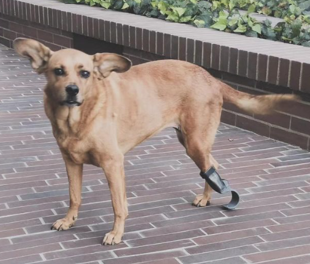
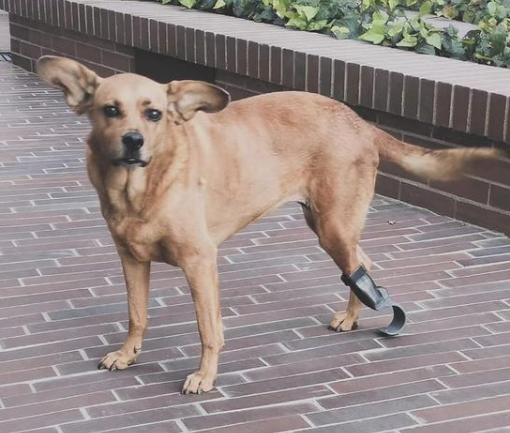
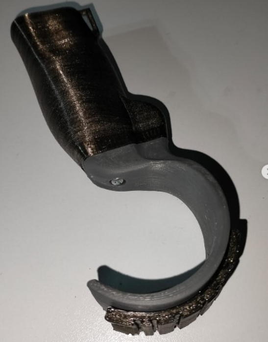
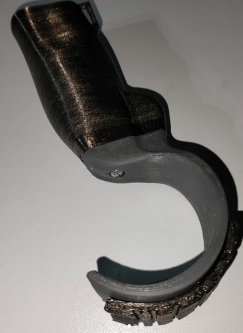
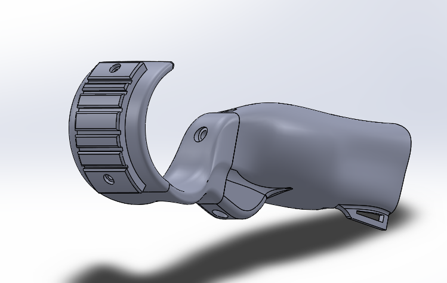

# PISADAS RENOVADAS: Cómo una prótesis 3D devolvió la alegría a Koda

> **Nota:** el texto completo de este articulo vivia en la base de datos del WordPress original, que ya no esta disponible. Abajo queda el extracto recuperado de `llms.txt` y todos los recursos graficos hallados en el backup.

pruebas de compresión

## Recursos graficos del backup original

