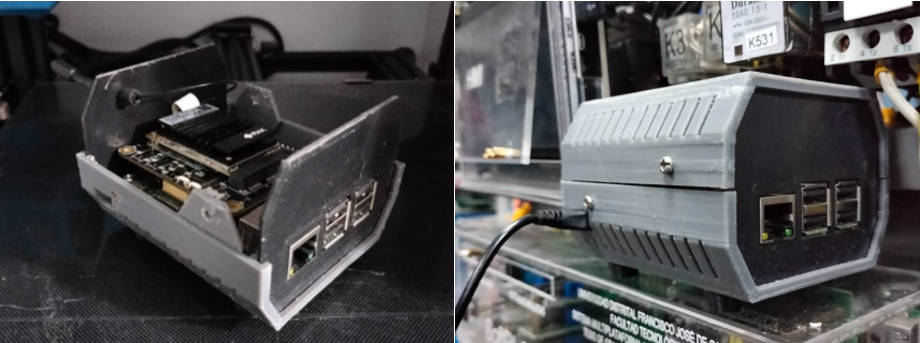

# El Poder del Prototipado Rápido con Impresión 3D

> **Nota:** el texto completo de este articulo vivia en la base de datos del WordPress original, que ya no esta disponible. Abajo queda el extracto recuperado de `llms.txt` y todos los recursos graficos hallados en el backup.

el prototipado rápido se ha convertido en un componente esencial para la innovación y el desarrollo eficiente de productos

## Recursos graficos del backup original

