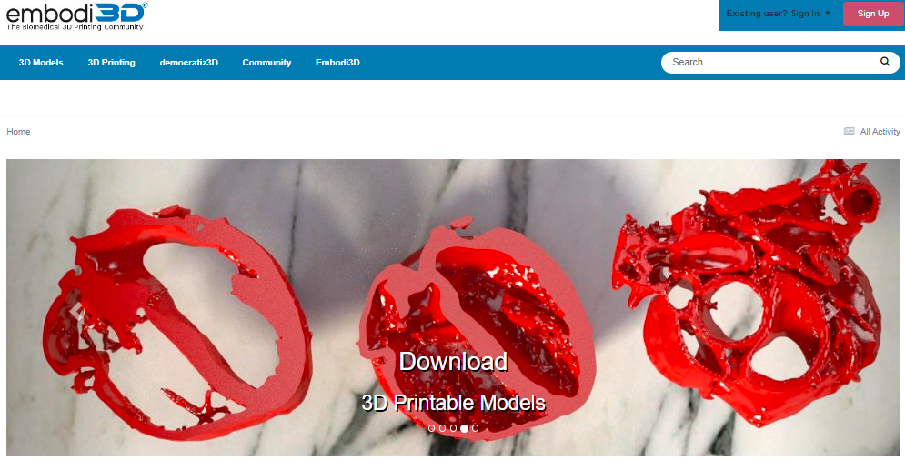
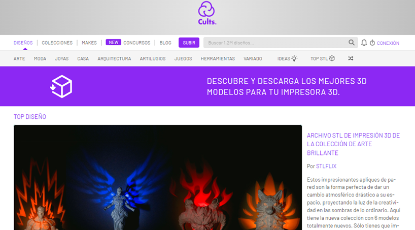
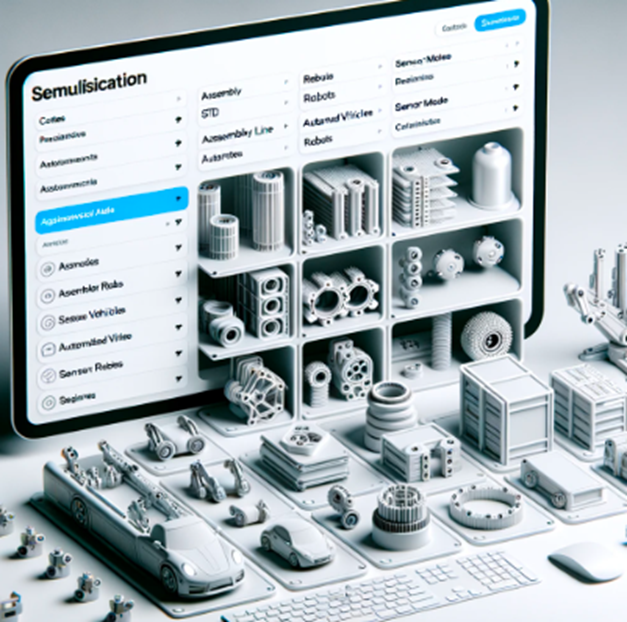

# Las Plataformas de Modelos 3D que Debes Conocer

> **Nota:** el texto completo de este articulo vivia en la base de datos del WordPress original, que ya no esta disponible. Abajo queda el extracto recuperado de `llms.txt` y todos los recursos graficos hallados en el backup.

En la era digital actual, la impresión 3D ha revolucionado la forma en que materializamos ideas, dando vida a todo, desde simples utensilios hasta complejas maquinarias.

## Recursos graficos del backup original

