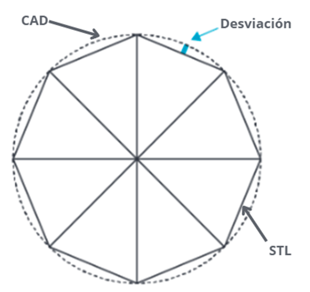

# Descubriendo los Formatos de Archivo 3D: Una Guía Esencial para la Impresión 3D

> **Nota:** el texto completo de este articulo vivia en la base de datos del WordPress original, que ya no esta disponible. Abajo queda el extracto recuperado de `llms.txt` y todos los recursos graficos hallados en el backup.

La impresión 3D ha transformado la fabricación, permitiendo la creación rápida de prototipos y productos complejos. Sin embargo, un aspecto crucial que a menudo se pasa por alto es la importancia de elegir el formato de archivo 3D correcto.

## Recursos graficos del backup original

