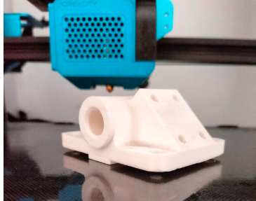
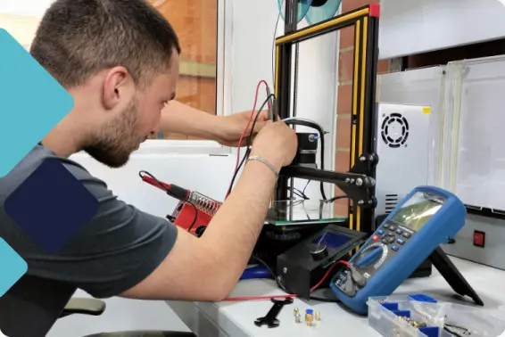
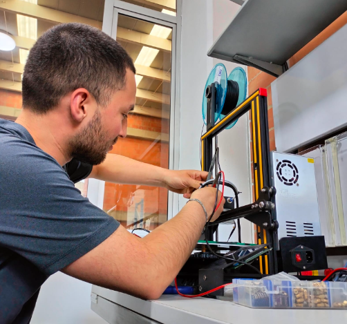

# Mantenimiento y Reparación de Impresoras 3D: Asegura su Óptimo Funcionamiento

> **Nota:** el texto completo de este articulo vivia en la base de datos del WordPress original, que ya no esta disponible. Abajo queda el extracto recuperado de `llms.txt` y todos los recursos graficos hallados en el backup.

Como cualquier otra máquina, las impresoras 3D requieren un mantenimiento regular para asegurar su óptimo funcionamiento. En este artículo, nos centraremos en el mantenimiento y la reparación de las impresoras 3D

## Recursos graficos del backup original

