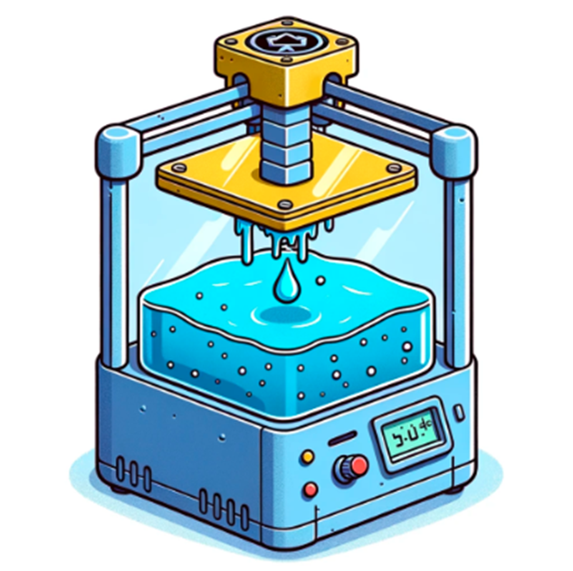
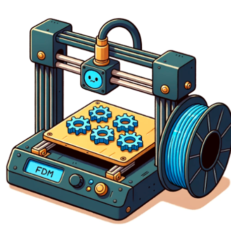

# Tirajes cortos y producción bajo demanda con impresión 3D

> **Nota:** el texto completo de este articulo vivia en la base de datos del WordPress original, que ya no esta disponible. Abajo queda el extracto recuperado de `llms.txt` y todos los recursos graficos hallados en el backup.

Con la impresión 3D podemos producir exactamente lo que se necesita, cuando se necesita. Pero, ¿qué significa esto exactamente y cuáles son las ventajas de este enfoque?

## Recursos graficos del backup original

- Video: [`ingenieros-trabajando-produccion-pieza.mp4`](recursos/ingenieros-trabajando-produccion-pieza.mp4)
