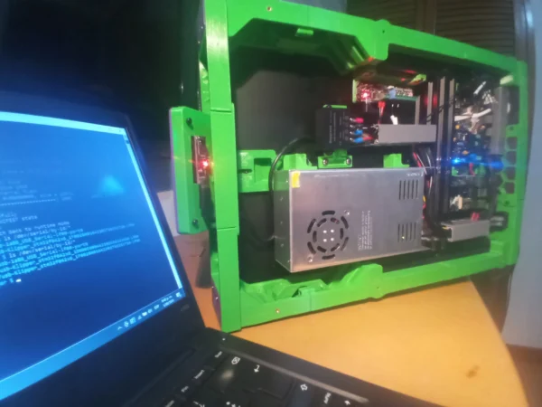
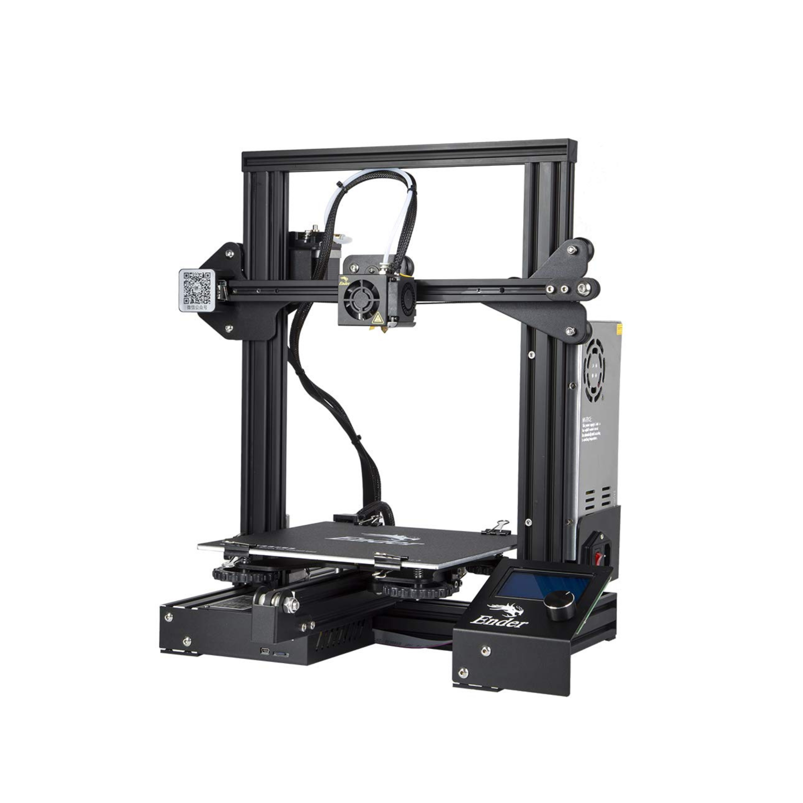
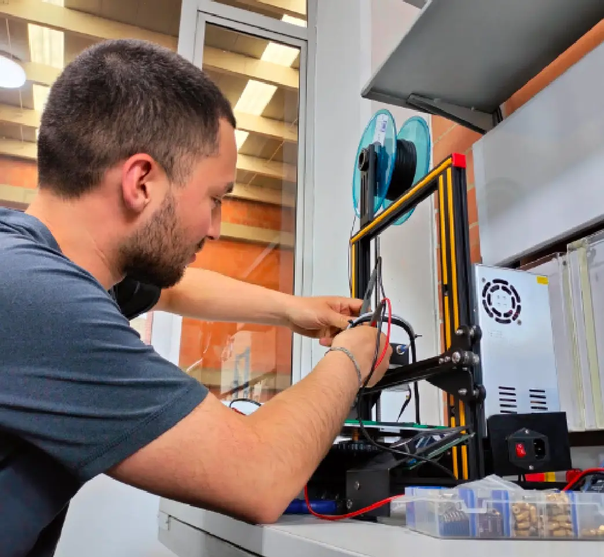
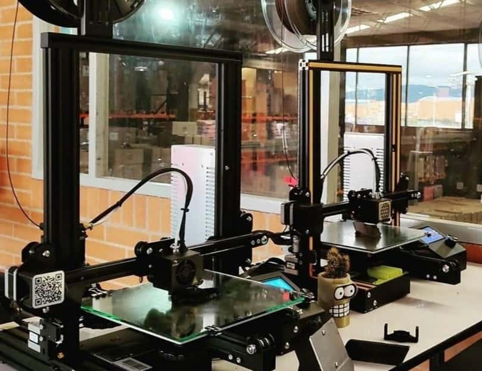
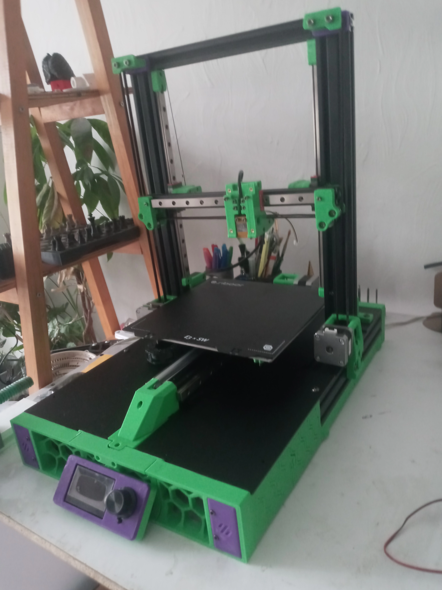

# Repotenciación de impresora 3D Ender 3

En este artículo detallamos la completa repotenciación de una impresora 3D Ender 3 llevada a cabo por CESGAR para superar sus limitaciones de fábrica. Mediante la conversión a un sistema mecánico CoreXZ con guías lineales y la integración de electrónica avanzada con Klipper y Raspberry Pi, logramos aumentar drásticamente la velocidad de impresión hasta 200 mm/s mejorando la precisión y el control; un servicio de actualización integral que ahora ofrecemos a todos los entusiastas de la fabricación digital.

## Repotenciación de impresora 3D Ender 3

La Ender 3 es una de las impresoras 3D más populares del mercado gracias a su bajo costo y buen rendimiento. De fábrica, ofrece una estructura cartesiana básica, volumen de impresión de 220x220x250 mm, velocidades de impresión moderadas (alrededor de 60 mm/s) y un extrusor tipo Bowden que cumple con tareas generales, pero presenta limitaciones para proyectos más exigentes.

Con el objetivo de superar estas limitaciones, realizamos una completa repotenciación de la máquina. Imprimimos todas las piezas necesarias para su transformación y reemplazamos los rodamientos por guías lineales, aumentando la precisión y reduciendo la fricción. Mecánicamente, rediseñamos la estructura para convertirla en un sistema CoreXZ, lo que nos permitió alcanzar velocidades de hasta 200 mm/s sin comprometer la calidad de impresión.

En el apartado electrónico, complementamos a la placa original una Raspberry Pi, una expansión para Klipper, un acelerómetro para calibraciones más finas, e instalamos luces LED para mejorar la visibilidad del área de trabajo. Además, actualizamos el extrusor para lograr una mejor alimentación del filamento.

La implementación de Klipper como firmware nos brindó un control más preciso de los movimientos y tiempos, optimizando así el rendimiento general de la máquina.

Invitamos a todos los usuarios de impresoras 3D a repotenciar sus equipos con CESGAR, donde ofrecemos tanto el servicio de modificación como la venta de repuestos y accesorios. ¡Dale nueva vida a tu impresora y alcanza un nuevo nivel de calidad y velocidad!

## Recursos graficos del backup original

- Video: [`repotenciacion-impresora-3d-ender3.mp4`](recursos/repotenciacion-impresora-3d-ender3.mp4)

