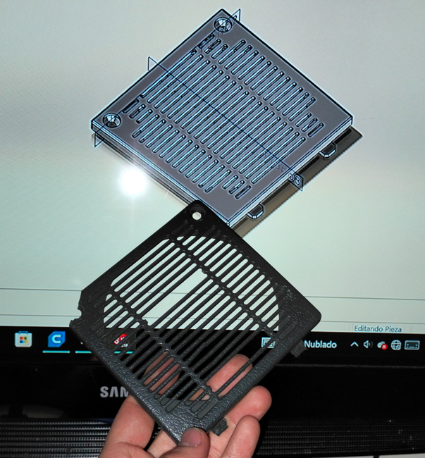
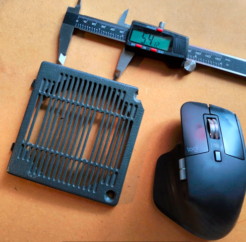
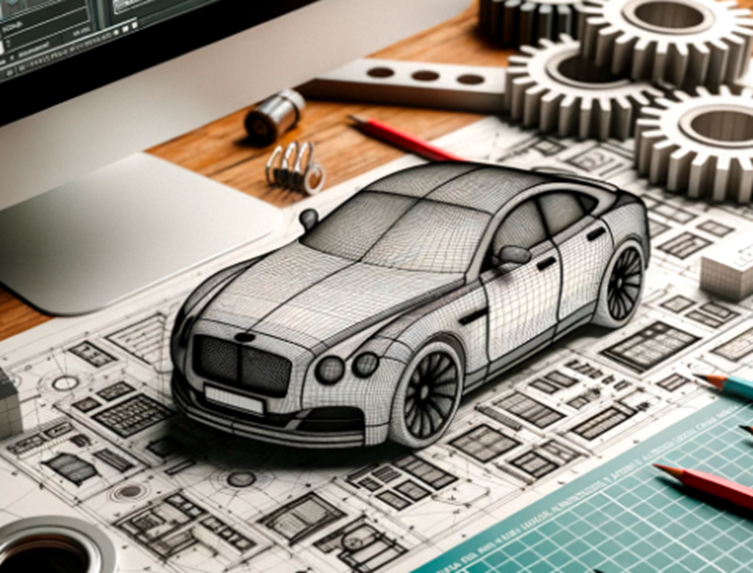

# Rejilla de Ventilación Personalizada para Carros

> **Nota:** el texto completo de este articulo vivia en la base de datos del WordPress original, que ya no esta disponible. Abajo queda el extracto recuperado de `llms.txt` y todos los recursos graficos hallados en el backup.

‹ Atrás Proyectos Rejilla de Ventilación Personalizada para Carros En CESGAR, nos especializamos en soluciones personalizadas para desafíos únicos. Un ejemplo reciente es nuestro trabajo con un cliente que posee un carro de los 90′. Este cliente no lograba encontrar el repuesto de la rejilla de ventilación que se había roto con el tiempo. Comparación: Rejilla de Ventilación Original Dañada vs. Diseño Personalizado en 3D para Restauración Haciendo uso de la impresión 3D, hemos diseñado y fabricado una rejilla de ventilación que no solo se adapta perfectamente al vehículo, sino que también recaptura la estética y funcionalidad del diseño original, […]

## Recursos graficos del backup original

