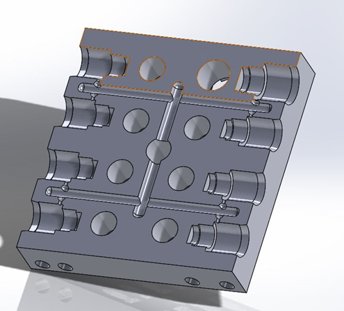
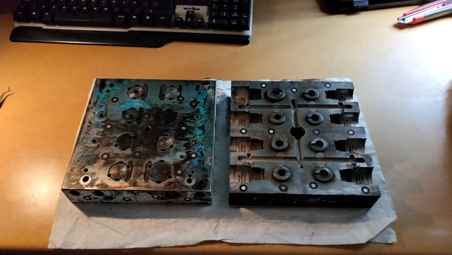
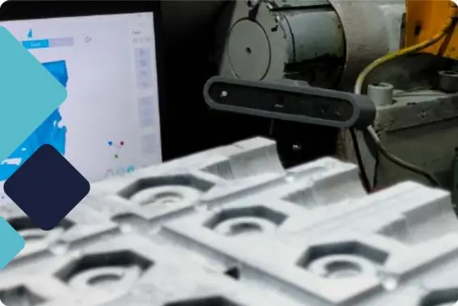

# Escáner 3D en la modificación de moldes

Descubre cómo en CESGAR aplicamos el escaneo y modelado 3D para ofrecer servicios de ingeniería inversa. En este artículo, mostramos un caso de éxito donde ayudamos a un cliente del sector de inyección de plástico a digitalizar y modificar su molde original, optimizando sus procesos de producción sin necesidad de recursos internos adicionales.

## Escáner 3D en la modificación de moldes

En CESGAR, ofrecemos una gama de servicios de impresión 3D que van más allá de la simple producción de piezas. Uno de estos servicios es la ingeniería inversa, que permite a nuestros clientes personalizar sus moldes y mejorar su proceso de producción.

Un ejemplo de esto es nuestro trabajo con un cliente que desarrolla piezas mediante inyección de plástico. Este cliente necesitaba personalizar su molde, pero no tenía la capacidad de hacerlo internamente.

En CESGAR, utilizamos nuestro servicio de escaneo y modelado 3D para realizar ingeniería inversa del molde. Esto permitió a nuestro cliente visualizar el molde en un formato digital y hacer las modificaciones necesarias.

Este servicio de ingeniería inversa es solo uno de los muchos que CESGAR ofrece para ayudar a nuestros clientes a optimizar sus procesos de producción y a aprovechar al máximo la tecnología de impresión 3D.

Este es solo un ejemplo de cómo nuestros servicios de impresión 3D pueden ayudar a nuestros clientes a personalizar sus productos y a llevar sus ideas a la realidad.

## Recursos graficos del backup original

