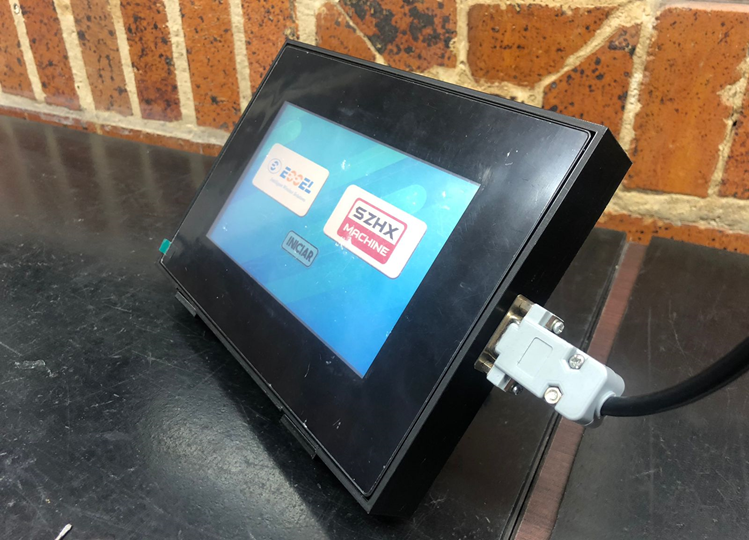
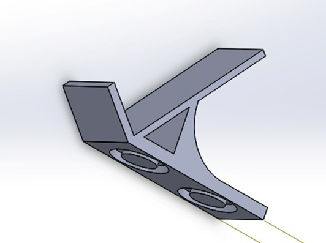
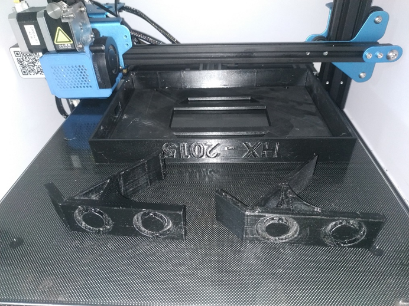

# HMI personalizado

En este artículo mostramos cómo en CESGAR transformamos un diseño digital en una solución física y funcional. Presentamos el caso de un cliente que diseñó una carcasa (case) a medida para un dispositivo HMI y nos envió el archivo STL. Gracias a nuestros servicios de impresión 3D bajo demanda, logramos fabricar una pieza de protección exacta y adaptada a sus necesidades específicas, demostrando las ventajas de la manufactura personalizada frente a las opciones estándar del mercado.

## HMI Personalizado: Del Diseño a la Realidad

En CESGAR, nos enorgullece ofrecer servicios de impresión 3D que permiten a nuestros clientes llevar sus ideas del diseño digital al mundo físico. Un ejemplo destacado de esto es nuestro reciente trabajo con un cliente que diseñó un case (carcasa) personalizado para un HMI (Interfaz Hombre-Máquina). A menudo, estos dispositivos requieren protecciones robustas o montajes muy específicos para su entorno de trabajo, algo que las soluciones comerciales estándar rara vez logran cubrir a la perfección.

Este cliente tenía necesidades muy particulares de montaje y ergonomía para su proyecto, por lo que diseñó una carcasa que se ajustaba milimétricamente a su maquinaria. Una vez finalizado, nos envió su diseño en formato STL, que es el tipo de archivo estándar más utilizado en la impresión 3D. Al recibir el modelo, nuestro equipo pudo procesarlo rápidamente para prepararlo para la fabricación.

En CESGAR, utilizamos nuestras impresoras 3D para producir el case exactamente según el diseño del cliente, utilizando materiales capaces de proteger adecuadamente los componentes electrónicos internos. Este servicio de manufactura bajo demanda permite a nuestros clientes tener un control total sobre el diseño y la funcionalidad de sus productos, asegurando que se integren perfectamente a sus necesidades sin los altos costos de la inyección de plástico tradicional.

Este caso de éxito es solo un ejemplo de cómo nuestros servicios de impresión 3D pueden ayudar a nuestros clientes a personalizar sus equipos, superar barreras de hardware y llevar sus ideas directamente a la realidad.
