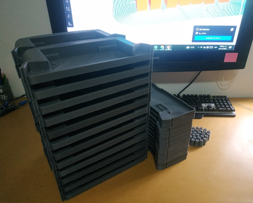
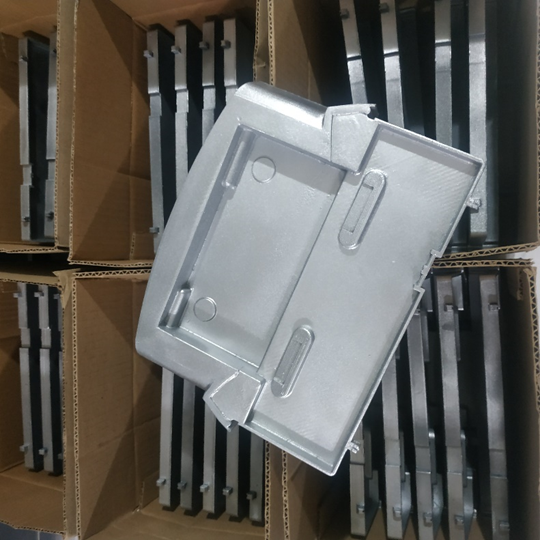

# Bandeja de goteo para máquinas vending

En este caso de éxito, explicamos cómo CESGAR solucionó el problema de escasez de repuestos para un cliente del sector de máquinas vending. Al diseñar y fabricar bandejas de goteo mediante impresión 3D, logramos sustituir las costosas y lentas importaciones por una producción local bajo demanda. Esto no solo redujo los tiempos de inactividad de las máquinas, sino que generó ahorros significativos, demostrando la rentabilidad de la manufactura aditiva en el mantenimiento de equipos.

## Bandeja de Goteo para Máquinas Vending: Soluciones Bajo Demanda

En CESGAR, utilizamos la impresión 3D para ofrecer soluciones personalizadas a problemas industriales y comerciales de todo tipo. Un excelente ejemplo de esto es nuestro reciente trabajo con un cliente del sector de dispensadores automáticos, quien necesitaba reemplazar las bandejas de goteo dañadas o extraviadas en sus máquinas vending. A menudo, conseguir estos repuestos específicos implica lidiar con piezas descontinuadas, altos costos de envío o largos tiempos de espera por importación.

Para resolver este inconveniente, desarrollamos un modelo digital exacto y fabricamos un prototipo de repuesto utilizando impresión 3D con materiales resistentes. Esta alternativa eliminó por completo la necesidad de importar las piezas, permitiendo una producción local y bajo demanda. De esta forma, el cliente puede solicitar exactamente la cantidad de bandejas que necesita, en el momento que las necesita, lo que se traduce en una reducción del tiempo de inactividad de sus máquinas y en ahorros económicos significativos.

En CESGAR, demostramos día a día cómo la manufactura aditiva y la impresión 3D son herramientas clave para ofrecer soluciones ágiles, personalizadas y altamente rentables, optimizando el mantenimiento de equipos para nuestros clientes.
