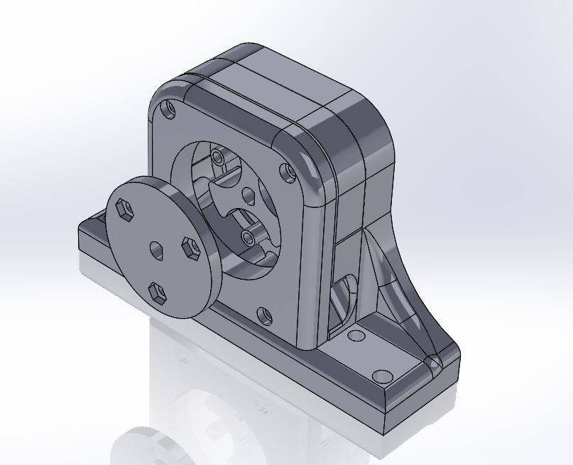
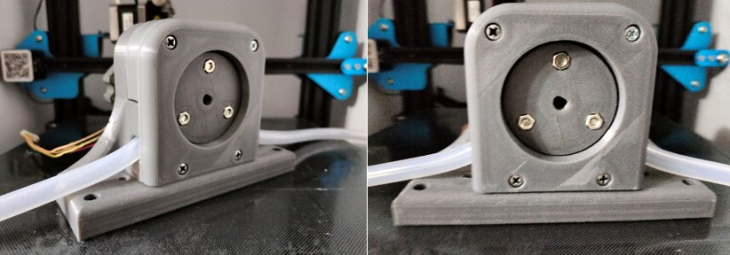

# Bomba Dosificadora para Producción de Bioetanol

En este artículo destacamos el desarrollo de una bomba dosificadora para la producción de bioetanol. Mediante el uso de impresión 3D, en CESGAR diseñamos y fabricamos una bomba peristáltica impulsada por un motor paso a paso. Esta solución a medida no solo redujo drásticamente los costos frente a las alternativas comerciales, sino que proporcionó la precisión y la resistencia necesarias para el manejo de fluidos industriales, demostrando el potencial de la manufactura aditiva en el sector energético.

## Bomba Dosificadora para Producción de Bioetanol

En CESGAR, nos especializamos en diseñar soluciones personalizadas para desafíos industriales únicos. Un excelente ejemplo de nuestra capacidad de innovación es nuestro trabajo con un cliente del sector energético que necesitaba una bomba dosificadora precisa para su línea de producción de bioetanol. A menudo, los equipos comerciales que ofrecen este nivel de precisión tienen costos prohibitivos o no se adaptan fácilmente a sistemas experimentales o a medida.

Para dar respuesta a esta necesidad, utilizamos el modelado y la impresión 3D para desarrollar una bomba peristáltica completamente funcional, impulsada por un motor paso a paso. Este diseño es ideal para el manejo de químicos y bioetanol, ya que el fluido solo tiene contacto con la manguera interna, evitando la corrosión de las piezas mecánicas y garantizando un bombeo exacto, controlado y libre de contaminación.

Gracias a la manufactura aditiva, logramos fabricar el rotor y la carcasa cumpliendo con las especificaciones técnicas del cliente de una manera altamente rentable y eficiente. En CESGAR, seguimos explorando y ampliando las posibilidades de la impresión 3D para ayudar a la industria a superar sus desafíos tecnológicos con soluciones accesibles.
