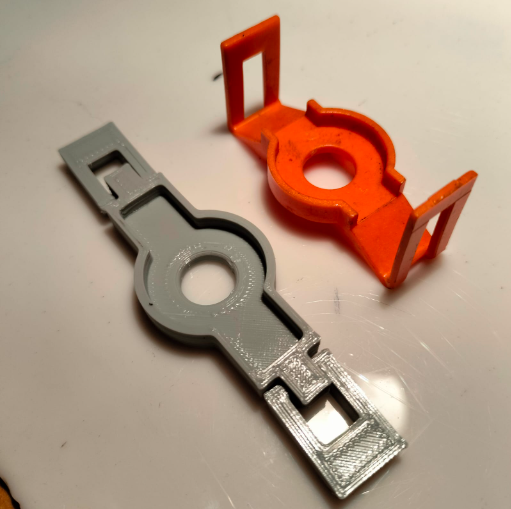
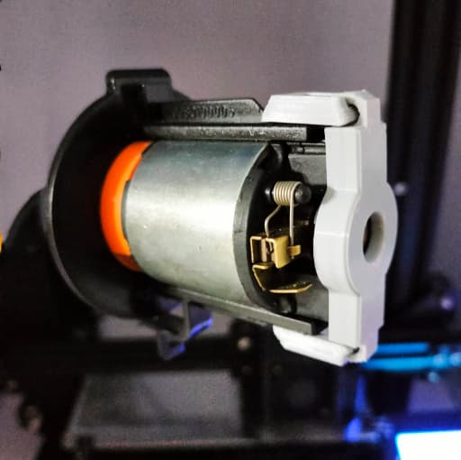
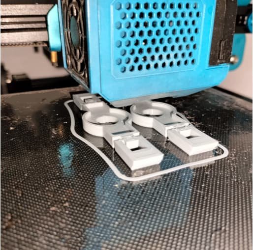

# Soporte de Motor Batidor: Producción Bajo Demanda y Mayor Resistencia

En este caso de éxito, abordamos el problema de un cliente de máquinas vending que sufría por la fragilidad del soporte de su motor batidor y las costosas importaciones para reemplazarlo. En CESGAR, rediseñamos y fabricamos mediante impresión 3D un repuesto más resistente y producido localmente. Esta solución permite la fabricación bajo demanda, eliminando la necesidad de importar grandes lotes y optimizando los costos de mantenimiento del cliente.

## Soporte de Motor Batidor: Producción Bajo Demanda y Mayor Resistencia

En CESGAR, nos enorgullece ofrecer servicios de impresión 3D para tirajes cortos y producción bajo demanda, proporcionando eficiencia, agilidad y flexibilidad a nuestros clientes industriales y comerciales.

Un claro ejemplo de cómo la manufactura aditiva puede resolver problemas logísticos y de diseño es nuestro trabajo con un cliente que opera máquinas vending. Ellos se enfrentaban a un inconveniente recurrente con un repuesto específico: el soporte del motor batidor. La pieza de fábrica era frágil, propensa a romperse con el uso continuo, y su reemplazo requería largas y costosas importaciones obligando a comprar en grandes cantidades.

Para solucionar este cuello de botella, utilizamos la impresión 3D para rediseñar y desarrollar un repuesto estructuralmente más resistente. Al fabricarlo localmente con materiales duraderos, eliminamos por completo la necesidad de importación. Además, este proceso productivo es altamente escalable y permite trabajar estrictamente bajo demanda; esto significa que el cliente ahora solo solicita la cantidad exacta que necesita, en el momento que la necesita, sin que el costo unitario por pieza se vea afectado.

En CESGAR, estamos emocionados por las infinitas posibilidades que la impresión 3D ofrece para la optimización del mantenimiento de equipos, y estamos fuertemente comprometidos a ayudar a nuestros clientes a aprovechar todos estos beneficios técnicos y económicos.
